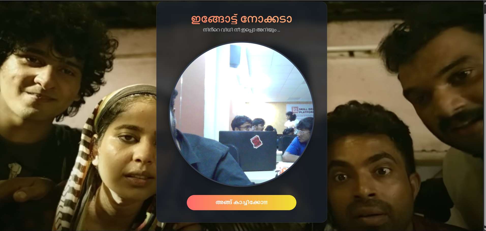
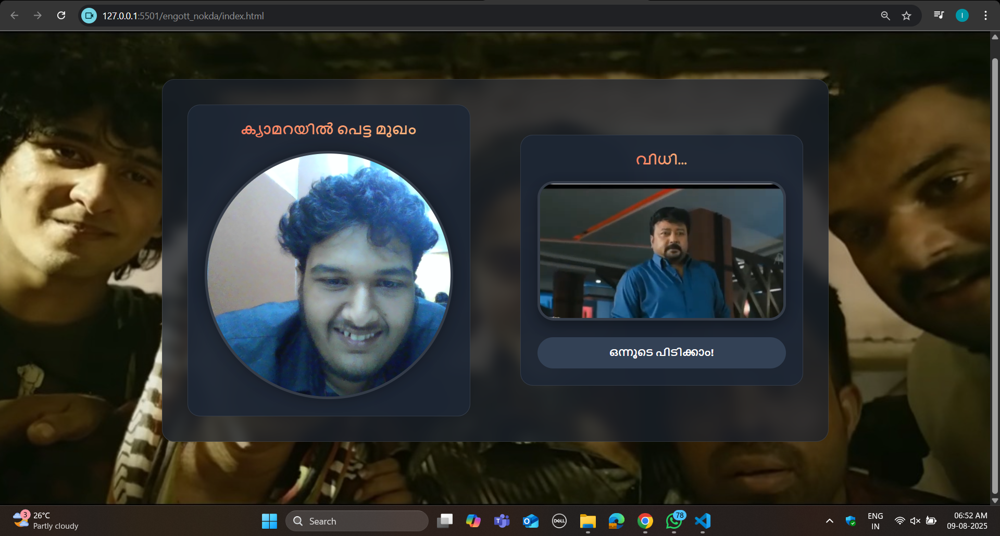

# [Engott Nokda] 🎯

## Basic Details
### Team Name: [Syntax]

### Team Members
- Team Lead: [Isabella Ebenezer] - [College of Engineering Perumon]
- Member 2: [Arjun M S] - [College of Engineering Perumon]

### Project Description
[This is a single-page web application that uses a user's webcam to take a photo. Based on the captured image, it displays a randomly selected movie scene, offering a fun and playful prediction of the user's "fate."]

### The Problem (that doesn't exist)
[No problem]

### The Solution (that nobody asked for)
[നിന്റെ വിധി നീ ഇപ്പൊ അറിയും... (You will know your fate now...)]

## Technical Details
### Technologies/Components Used
For Software:
- [HTML, CSS, JavaScript]
- [Tailwind CSS]
- [Google Fonts, Web browser's navigator.mediaDevices API for webcam access, and the <canvas> element for image capture.]
- [Tools used]

For Hardware:
- [List main components]
- [List specifications]
- [List tools required]

### Implementation
For Software:
# Installation
[There are no installation steps. This is a client-side web application.]

# Run
[commands]

### Project Documentation
For Software:

# Screenshots (Add at least 3)

*This shows the initial home page where the user can see their live webcam feed and the button to take a photo.*

*This is the results page, displaying the captured image and the "വിധി..." (Fate) in the form of a random movie scene*

*Add caption explaining what this shows*

# Diagrams

The app's workflow is a simple two-page flow. The home page displays the webcam. When the user takes a photo, the app transitions to a second page that displays the captured image and a random video from a predefined list. The user can then click to return to the home page to start over.

For Hardware:

# Schematic & Circuit

*Add caption explaining connections*

*Add caption explaining the schematic*

# Build Photos

*List out all components shown*

*Explain the build steps*

*Explain the final build*

### Project Demo
# Video
[Add your demo video link here]
*Explain what the video demonstrates*

# Additional Demos
[Add any extra demo materials/links]

## Team Contributions
- Isabella Ebenezer: Project Lead, initial UI/UX design, and overall project structure.
- Arjun M S: Core JavaScript logic, event handling, camera API integration, and implementation of visual effects like the shutter flash and page transitions.

---
Made with ❤️ at TinkerHub Useless Projects 

